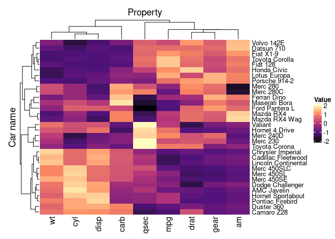

tidyHeatmap
================

<!-- badges: start -->

[](https://www.tidyverse.org/lifecycle/#maturing)
<!-- badges: end -->

Tidy heatmap. This package is a tidy wrapper of the package
[ComplexHeatmap](https://bioconductor.org/packages/release/bioc/html/ComplexHeatmap.html).
The goal of this package is to interface tidy data frames with this
powerful tool.

Some of the advantages are:

  - Row and/or columns colour annotations are easy to integrate just
    specifying one parameter (column names).
  - Custom grouping of rows is easy to specify providing a grouped tbl.
    For example `df %>% group_by(...)`
  - Labels size adjusted by row and column total number
  - Default use of Brewer and Viridis palettes

# Installation

To install the most up-to-date version

``` r
devtools::install_github("stemangiola/tidyHeatmap")
```

To install the most stable version (however please keep in mind that
this package is under a maturing lifecycle stage)

``` r
instll.packages("tidyHeatmap")
```

# Input data frame

Example of an input data frame

``` r
tidyHeatmap::pasilla
```

    ## # A tibble: 504 x 7
    ##    sample   symbol `count normalised ad… condition type    location   activation
    ##    <chr>    <fct>                  <int> <fct>     <fct>   <chr>           <dbl>
    ##  1 treated1 Kal1                      37 treated   single… Secretory       1.10 
    ##  2 treated2 Kal1                      41 treated   paired… Secretory       1.10 
    ##  3 treated3 Kal1                      50 treated   paired… Secretory       1.10 
    ##  4 untreat… Kal1                    1127 untreated single… Secretory       1.10 
    ##  5 untreat… Kal1                    1046 untreated single… Secretory       1.10 
    ##  6 untreat… Kal1                     932 untreated paired… Secretory       1.10 
    ##  7 untreat… Kal1                    1018 untreated paired… Secretory       1.10 
    ##  8 treated1 Ant2                    2331 treated   single… Intracell…      0.329
    ##  9 treated2 Ant2                    2478 treated   paired… Intracell…      0.329
    ## 10 treated3 Ant2                    2575 treated   paired… Intracell…      0.329
    ## # … with 494 more rows

# Plot

For plotting, you simply pipe the input data frame into heatmap,
specifying:

  - The horizontal, vertical relative column names (mandatory)
  - The abundance column name (mandatory)
  - The annotations column name(s)

<!-- end list -->

``` r
tidyHeatmap::pasilla %>%
    heatmap(
        .horizontal = sample,
        .vertical = symbol,
        .abundance = `count normalised adjusted`,
        annotation = c(condition, type),
        log_transform = TRUE
    )
```

<!-- -->

# Grouping

We can easily group the data (one group per dimension maximum, at the
moment only the vertical dimension is supported) with dplyr, and the
heatmap will be grouped accordingly

``` r
tidyHeatmap::pasilla %>%
    group_by(location, condition) %>%
    heatmap(
        .horizontal = sample,
        .vertical = symbol,
        .abundance = `count normalised adjusted`,
        annotation = c(type),
        log_transform = TRUE
    )
```

<!-- -->

# Custom palettes

We can easily use custom palette, chooinga hexadecimal color character
vector, or a grid::colorRamp2 functionfor higher flexibility

``` r
pasilla %>%
    heatmap(
        .horizontal = sample,
        .vertical = symbol,
        .abundance = `count normalised adjusted`,
        log_transform = TRUE, 
        palette_abundance = circlize::colorRamp2(c(-2, -1, 0, 1, 2), viridis::magma(5))
    )
```

<!-- -->
