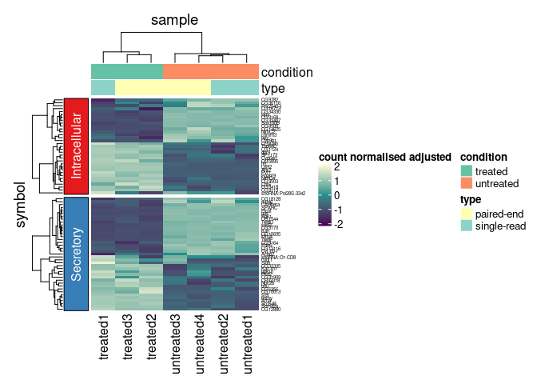

tidyHeatmap
================

This package is a tidy wrapper of the package
[ComplexHeatmap](https://bioconductor.org/packages/release/bioc/html/ComplexHeatmap.html).
The goal of this package is to interface a tidy data frame with this
powerful tool.

Some of the advantages are:

  - Row and/or columns colour annotations are easy to integrate just
    specifying one parameter (column names).
  - Custom grouping of rows is easy to specify providing a grouped tbl.
    For example `df %>% grup_by(...)`
  - Labels size adjusted by row and column total number
  - Default use of Brewer and Viridis palettes

## Input data frame

The input data frameha sto be a tidy `tbl` of this form

``` r
pasilla
```

    ## # A tibble: 504 x 6
    ##    sample     symbol `count normalised adjust… condition type       location    
    ##    <chr>      <fct>                      <int> <fct>     <fct>      <chr>       
    ##  1 treated1   Kal1                          37 treated   single-re… Secretory   
    ##  2 treated2   Kal1                          41 treated   paired-end Secretory   
    ##  3 treated3   Kal1                          50 treated   paired-end Secretory   
    ##  4 untreated1 Kal1                        1127 untreated single-re… Secretory   
    ##  5 untreated2 Kal1                        1046 untreated single-re… Secretory   
    ##  6 untreated3 Kal1                         932 untreated paired-end Secretory   
    ##  7 untreated4 Kal1                        1018 untreated paired-end Secretory   
    ##  8 treated1   Ant2                        2331 treated   single-re… Intracellul…
    ##  9 treated2   Ant2                        2478 treated   paired-end Intracellul…
    ## 10 treated3   Ant2                        2575 treated   paired-end Intracellul…
    ## # … with 494 more rows

Where mandatory column are `sample`, `transcript`, count (named as you
wish)

## Plot

For plotting, you simply pipe the input data frame into heatmap,
specifying:

  - The horizontal, vertical relative column names (mandatory)
  - The abundance column name (mandatory)
  - The annotations column name(s)

<!-- end list -->

``` r
pasilla %>%
    heatmap(
        .horizontal = sample,
        .vertical = symbol,
        .abundance = `count normalised adjusted`,
        annotation = c(condition, type),
        log_transform = T
    )
```

<!-- -->

## Grouping

We can easily group the data (one group per dimension maximum, at the
moment only the vertical dimension is supported) with dplyr, and the
heatmap will be grouped accordingly

``` r
pasilla %>%
    group_by(location) %>%
    heatmap(
        .horizontal = sample,
        .vertical = symbol,
        .abundance = `count normalised adjusted`,
        annotation = c(condition, type),
        log_transform = T
    )
```

<!-- -->
